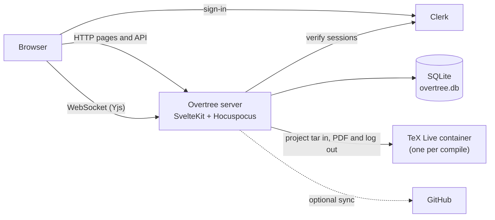
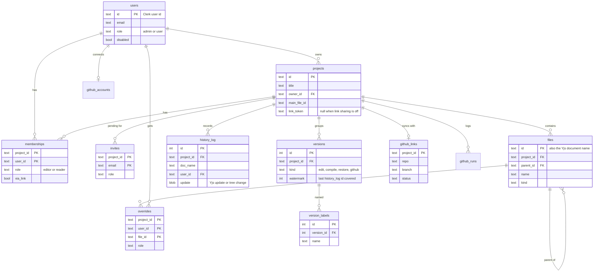

# Overtree

A self-hosted LaTeX editor in the spirit of Overleaf. Write LaTeX with other people in real time, compile to PDF in a sandboxed TeX Live container, and keep everything on your own server.

- Projects dashboard with templates (blank, article, report, beamer, letter) and zip import
- Live collaboration with named cursors, offline edits that merge on reconnect
- Sharing with Owner, Editor and Reader roles, by email or link, and per file or folder
- CodeMirror editor with tabs and LaTeX autocomplete (commands, environments, labels, citations, files)
- PDF preview with SyncTeX jumps in both directions
- Full history: browse versions, diff, label, restore a file or the whole project
- Optional two-way sync with a GitHub repository

## Install

You need Docker with Compose and a free [Clerk](https://clerk.com) account for sign-in.

**1. Get the code and the TeX image**

```sh
git clone <this repository> overtree
cd overtree
docker pull texlive/texlive:latest-medium   # about 1 GB, pulled once
```

The medium image covers common documents. For packages it lacks (extra fonts, less common packages, language packs and so on), use the full TeX Live image instead. That's what the main Overtree server runs:

```sh
docker pull texlive/texlive:latest-full     # several GB
```

and add `TEXLIVE_IMAGE=texlive/texlive:latest-full` to `.env` in step 3. Compose passes it to the app and pre-pulls it on `up`.

**2. Create a Clerk application**

1. In the [Clerk dashboard](https://dashboard.clerk.com), create an application. A development instance is fine for a private server.
2. Under Configure, User & authentication: turn on email sign-in with both the verification code and password. Add Google under SSO connections if you want it.
3. Under API keys, copy the publishable key (`pk_...`) and the secret key (`sk_...`).

**3. Write a `.env` file** next to `compose.yaml` (it is gitignored):

```sh
PUBLIC_CLERK_PUBLISHABLE_KEY=pk_test_...
CLERK_SECRET_KEY=sk_test_...
ADMIN_EMAILS=you@example.org
```

**4. Start it**

```sh
docker compose up -d --build   # http://127.0.0.1:3000
```

Sign in. The first account becomes the site admin. Data lives in the `overtree-data` volume and survives `docker compose down`.

**Linux hosts:** the app starts compile containers through the Docker socket, which on Linux usually belongs to the `docker` group. Add `DOCKER_GID=$(stat -c %g /var/run/docker.sock)` to `.env`. Docker Desktop and OrbStack work with the default.

**Behind a domain:** the port is bound to `127.0.0.1` only. Put a TLS proxy in front and add `ORIGIN: https://tex.example.org` (or `PROTOCOL_HEADER: x-forwarded-proto`) to the app's `environment` in `compose.yaml`. Without it, uploads and deletes fail SvelteKit's same-origin check. For a production Clerk instance, add your domain in Clerk and follow its DNS steps.

> The Docker socket gives the app control of the host's Docker, which is root-equivalent. The app code is trusted; user LaTeX only runs inside locked-down job containers with no network, a read-only root, a non-root user and memory, CPU and time limits.

## How it works



Text files are Yjs documents served over Hocuspocus, so every keystroke reaches collaborators directly and is stored in SQLite. A compile streams the project into a fresh container and gets the PDF back, so the app and the job share no files. Roles are checked on the server for every route and socket; non-members get a 404.

## Data model

All state is in one SQLite file. The main tables:



Besides these, `documents` and `updates` hold the live Yjs state, `settings` holds the sign-up policy, `compile_settings` the compiler per project, and `github_accounts` / `github_runs` the encrypted GitHub tokens and the sync log. The schema is in `src/lib/server/schema.ts`.

## Using it

### Roles and sharing

| Role | Can |
| --- | --- |
| Owner | Everything, including sharing, per-file permissions, transferring ownership and deleting. One per project. |
| Editor | Edit files and the tree, set the main document and compiler, compile, download. |
| Reader | Read files, compile, download the PDF and zip, duplicate the project. |

- **Share** (owner): invite by email. Someone without an account gets a pending invite that becomes access when they sign up.
- **Link sharing**: a link with Editor or Reader access. Opening it still needs sign-in. Resetting or turning off the link removes everyone who joined only through it.
- **Per-file permissions**: give one collaborator a different role on a file or folder. The nearest override up the folder chain wins.

Access changes apply within seconds, without a reload.

### Admin

Site admins get an Admin page (`/admin`) to promote, demote and disable users, delete projects, and set the sign-up policy. **Invite-only** (the default) admits the first user, `ADMIN_EMAILS`, people with a pending invite and an allowlist of emails or `@domains`. **Open** admits anyone with a Clerk account.

### Files and compile

The sidebar holds the file tree and an outline. Upload files or drag them in from the desktop, and download the whole project as a zip. A zip uploaded on the dashboard becomes a new project; its main document is the root `main.tex`, else the shallowest `.tex` with `\documentclass`.

Compiling runs `latexmk` (with bibtex or biber as needed). Clicking a log entry opens the file at that line. Ctrl/Cmd+Alt+J jumps from the cursor to the PDF; double-clicking the PDF jumps back to the source. The Layout menu switches between side-by-side, editor only, PDF only and a separate PDF window.

### History

Every edit and tree change is logged with its author and grouped into versions: after 5 minutes of quiet, after 30 minutes of continuous editing, or on compile. Open History in the top bar to browse versions, compare with the current state, label a version, download it as a zip, or restore a file or the whole project. A restore is a new edit; it never rewrites history.

### GitHub sync

Optional. A project can sync both ways with one branch of a GitHub repository. Overtree pulls on open and every 2 minutes while open, and pushes one commit after everyone has closed the project (or on Push now). Commits are never force-pushed, and each collaborator gets a `Co-authored-by` trailer with their Overtree email, so those emails become visible to anyone who can read the repository. Build files, `.github/` and PDFs compiled from a `.tex` of the same name are skipped by default.

To turn it on, create a GitHub App (Settings, Developer settings, GitHub Apps):

1. Homepage URL: your Overtree URL. Callback URL and Setup URL: `<overtree>/api/github/callback`.
2. Tick "Request user authorization (OAuth) during installation" and "Redirect on update". Keep token expiry on.
3. Webhook: untick Active. Overtree polls, so GitHub needs no access to your server.
4. Repository permissions: Contents read and write, Metadata read-only. Nothing else.
5. Create it, then generate a client secret and a private key.

Set all five `GITHUB_APP_*` variables below and restart. In a project, the owner opens GitHub in the top bar and connects a repository.

## Configuration

Only the two Clerk keys are required. Docker Compose passes the Clerk, admin, port, compile, upload and GitHub App variables from `.env`; the others (`ORIGIN`, `PROTOCOL_HEADER`, `HISTORY_*`, `GITHUB_API_URL`) go in the app's `environment` in `compose.yaml`.

| Variable | Default | Meaning |
| --- | --- | --- |
| `PUBLIC_CLERK_PUBLISHABLE_KEY` | required | Clerk publishable key. |
| `CLERK_SECRET_KEY` | required | Clerk secret key. |
| `CLERK_JWT_KEY` | unset | Clerk's JWT public key (PEM), so session checks need no network. |
| `ADMIN_EMAILS` | empty | Comma-separated emails that are always site admins. |
| `ORIGIN` / `PROTOCOL_HEADER` | unset | Set one when a TLS proxy sits in front. |
| `OVERTREE_BIND` | `127.0.0.1` | Host address the port is published on. `0.0.0.0` exposes it on the LAN. |
| `PORT` | `3000` | Host port. |
| `DATA_DIR` | `/data` in Docker, `./data` otherwise | Where `overtree.db` lives. |
| `DOCKER_GID` | `0` | Group that owns the Docker socket (compose only). |
| `TEXLIVE_IMAGE` | `texlive/texlive:latest-medium` | Image each compile runs in. Use `texlive/texlive:latest-full` for every TeX Live package. |
| `COMPILE_TIMEOUT_MS` | `20000` | Time limit per compile. |
| `COMPILE_MEMORY` | `512m` | Memory limit per compile. |
| `COMPILE_CPUS` | `1` | CPU limit per compile. |
| `UPLOAD_MAX_FILE_MB` | `50` | Largest uploaded file. |
| `IMPORT_MAX_MB` | `200` | Largest unpacked size of an imported zip. |
| `PROJECT_MAX_FILES` | `2000` | Most files and folders in a project. |
| `HISTORY_IDLE_MS` | `300000` | Pause that closes a history version. |
| `HISTORY_MAX_OPEN_MS` | `1800000` | Longest a version stays open while editing continues. |
| `HISTORY_SWEEP_MS` | `30000` | How often the server checks for versions to close. |
| `GITHUB_APP_ID` | unset | GitHub App ID. Unset turns GitHub sync off. |
| `GITHUB_APP_SLUG` | with the ID | The App's URL name (`github.com/apps/<slug>`). |
| `GITHUB_APP_CLIENT_ID` | with the ID | The App's client ID. |
| `GITHUB_APP_CLIENT_SECRET` | with the ID | The App's client secret. |
| `GITHUB_APP_PRIVATE_KEY` | with the ID | The App's private key PEM; one line with literal `\n` works. |
| `GITHUB_API_URL` / `GITHUB_URL` | GitHub.com | For GitHub Enterprise Server. |

## Develop

Needs Node 24+, pnpm 10 and Docker (for compiles).

```sh
pnpm install
set -a; . ./.env; set +a      # load the Clerk keys into the shell
pnpm dev                      # http://localhost:5173
pnpm build && pnpm start      # production server without Docker
```

### Test

```sh
pnpm check                                             # svelte-check and TypeScript
pnpm test                                              # unit tests (sandbox tests need Docker and the TeX image)
pnpm exec playwright install chromium firefox webkit   # once
pnpm test:e2e                                          # end-to-end on three browsers
pnpm exec playwright test --project=clerk              # against a real Clerk dev instance (needs the keys)
```

Unit and e2e tests sign in through a test bypass instead of Clerk (`OVERTREE_TEST_AUTH=1`), so they run offline and can act as several users. The bypass is refused when `NODE_ENV=production`, which the Docker image sets. `scripts/compose-smoke.sh` builds the image and checks the signed-out behavior, including that the bypass can't be enabled.
